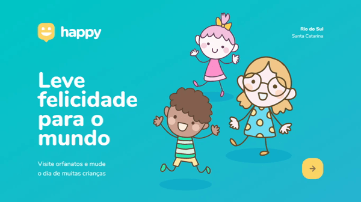
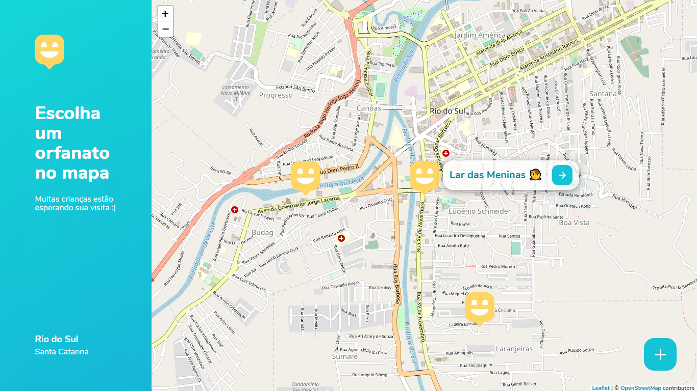
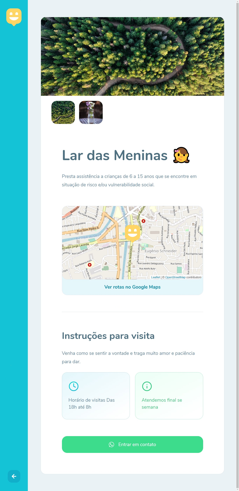
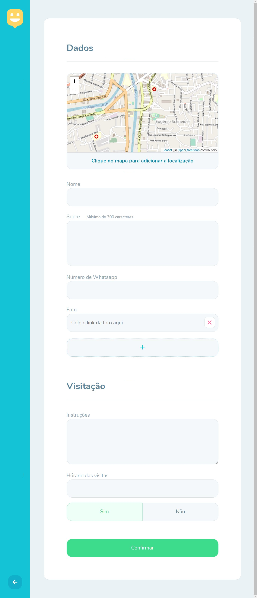

<h1 align="center">
   
</h1>

# NLW-3-Discovery 
Projeto construído durante o Next Level Week #03

  <a href="#-tecnologias">Tecnologias</a> &nbsp;&nbsp;&nbsp;|&nbsp;&nbsp;&nbsp;
  <a href="#-projeto">Projeto</a> &nbsp;&nbsp;&nbsp;|&nbsp;&nbsp;&nbsp;
  <a href="#-layout">Layout</a> &nbsp;&nbsp;&nbsp;|&nbsp;&nbsp;&nbsp;
  <a href="#-licença">Licença</a> &nbsp;&nbsp;&nbsp;|&nbsp;&nbsp;&nbsp;

 
 
 

<strong>Happy - Home</strong>

  

  <strong>Happy - Orphanages</strong>

     

 
  
 

 

## 🚀 Tecnologias 

Esse projeto foi desenvolvido com as seguintes tecnologias:

* [Node.js](https://nodejs.org)
* [Express](https://expressjs.com)
* [SQLite](https://sqlite.org)
* [Handlebars](https://handlebarsjs.com)

 

## 💻 Projeto 
O happy é uma aplicação que conecta pessoas à casa de acolhimento institucional para fazer o dia de muitas crianças mais feliz.

Esse é um projeto desenvolvido durante durante a terceira **[Next Level Week](https://nextlevelweek.com)**, realizada pela **[@Rocketseat](https://github.com/Rocketseat)**. 

 

## 📝 Licença 
Esse projeto está sob a licença MIT. Veja o arquivo [LICENSE](LICENSE.md) para mais detalhes.
